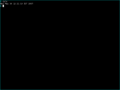
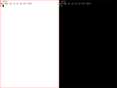
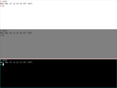
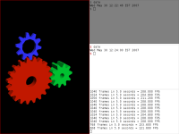
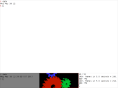
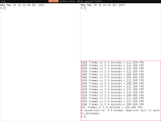
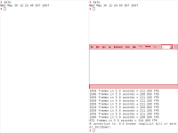
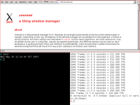
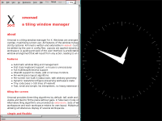
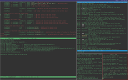

### Getting started with xmonad

This is a guided tour of the core features of the xmonad window manager, allowing you to gain an understanding of the motivation, and use of a tiling window manager, and learn how to achieve the kind of screen configuration you want, simply and easily.

<div class="row">
<div class="col-6">

- [Starting xmonad](#starting-xmonad)
- [Opening clients](#opening-clients)
- [Layout modes](#layout-modes)
- [Moving focus](#moving-focus)
- [Shuffling window order](#shuffling-window-order)
- [Resizing clients](#resizing-clients)
- [Floating clients](#floating-clients)
- [Deleting windows](#deleting-windows)
- [Launching clients from dmenu](#launching-clients-from-dmenu)
- [Using other workspaces](#using-other-workspaces)

</div>
<div class="col-6 align-middle">
[](./images/screen-dons-tall-status.png)
</div>
</div>

#### Starting xmonad

We'll assume you've been able to build xmonad from hackage (or from your package system). If not, seeing the [build instructions](install-instructions.html). You can then start xmonad directly from your .xsession or .xinitrc file, by executing it as so:

```
    # .xsession

    xrdb -merge .Xresources
    xpmroot ~/background.xpm &

    $HOME/bin/xmonad
```

Note the use of xpmroot to set a background image.

     
* [How to build xmonad by hand](./intro.html#comp)
* [How to use a display manager with xmonad](http://haskell.org/haskellwiki/Xmonad/Frequently_asked_questions#How_can_I_use_xmonad_with_a_display_manager.3F_.28xdm.2C_kdm.2C_gdm.29)

#### Opening clients

When you start xmonad, without launching clients, you'll be presented with an empty screen:

<center>[](./images/tour/large/empty.png)</center>

Let's start some clients, to fill the screen. xmonad uses the mod1 key (alt) by default, and we can start by launching a terminal with **mod-shift-return**. The new terminal will fill the screen (and we'll use a bit of image processing to contrast the terminals a bit for the tutorial):

<center>[](./images/tour/large/one.png)</center>

Let's open up another terminal **mod-shift-return**:

<center>[](./images/tour/large/two.png)</center>

The window manager has now tiled the screen such that both windows fit, without overlaps, filling the plane. Note that the new window was inserted to the left of the previous window. What happens if we insert another client? **mod-shift-return**.

<center>[](./images/tour/large/three.png)</center>

xmonad uses a simple tiling algorithm to tile the windows to fill the screen without gaps, while ensuring space is managed in a reasonable way. xmonad, by default, divides the screen into two panes. All windows are then partitioned into these two panes. The ratio each pane takes up on the screen is configurable, as are the number of clients in each pane. By convention, one pane is denoted as the 'master' pane, and is used to place the largest window. Other tiling algorithms are possible, (for example, fullscreen mode, or floating windows), and in these the concept of a `pane' has no real meaning.

#### Layout modes 


We can try out the other layouts now, with **mod-space**, which cycles through the available tiling algorithms:

<center>[](./images/tour/large/mirror.png)</center>

The next mode up is the 'wide' mode, a 90-degree rotation of the initial tiling. This is useful for smaller screens. If we hit **mod-space** again, we end up in fullscreen mode, where the currently focused window is maximisd, and the only visible window:

<center>[](./images/tour/large/full.png)</center>

Other tiling algorithms may be written directly in configuration files.

* [A library of alternative tiling algorithms, and much more](https://hackage.haskell.org/package/xmonad-contrib)

#### Moving focus

Let's return now to the original 'tall' tiling, **mod-space**. We can move focus around with the mouse, or with mod-j and mod-k (which moves the window focus up or down) (coloured red here for emphasis):

<center>[](./images/tour/large/focus.png)</center>

We can also increase, or decrease, the number of windows stored in the master pane, with mod-comma and mod-period:

<center>[](./images/tour/large/inc1.png)</center>

and again **mod-comma**:

<center>[](./images/tour/large/inc2.png)</center>

Use **mod-period** a few times to decrement the master pane count back to 1, to return to the default tiling.

#### Shuffling window order

Now, let's open up another client, we'll launch glxgears:

<center>[](./images/tour/large/glxgears.png)</center>

We can shuffle the window ordering in three ways: **mod-return**, **mod-shift-j** and **mod-shift-k**. First, let's try **mod-return**, which swaps the focused window with the window in the master pane:

<center>[](./images/tour/large/glxgears2.png)</center>

**mod-shift-j** (and its inverse, **mod-shift-k**), swap the currently focused window with its neighbour above or below. This allows us to 'bubblesort' the window ordering, to achieve a desired ordering of windows. Applying **mod-shift-j** twice:

<center>[](./images/tour/large/glxgears.png)</center>

and we're back where we started.

#### Resizing clients

We can resize the ratio between the master and subordinate areas with **mod-h** and **mod-l**. Hitting **mod-h** a few times:

<center>[](./images/tour/large/inc.png)</center>

Now, let's cycle to wide mode, and shrink (**mod-space**, then **mod-l**):

<center>[](./images/tour/large/dec.png)</center>

We can return to tall mode by cycling through the tiling modes some more.

#### Floating clients

xmonad supports <emph>floating windows</emph>. Certain windows (such as transients) will be placed in a floating layer in front of all the tiled windows. Additionally, you can move a window to or from the floating layer on demand. To float a window (or move an already-floating window), click and drag it with the **mod-button1** held down. To flatten the window back down to the tiling layer use **mod-t**. Floating windows can be resized by dragging the window with **mod-button3**, and a floating window can be brought to the top with **mod-button2**.

#### Deleting windows

When a window is closed naturally, or using **mod-shift-c** to kill it, focus is moved to the next window down in the workspace list. Let's kill glxgears. Focus should move to the xterm below it:

<center>[](./images/tour/large/kill.png)</center>

To fully quit xmonad, use **mod-shift-q** to exit X (don't do that now!).

#### Launching clients from dmenu

Assuming you have installed 'dmenu', you can launch programs from the status bar, by typing a few characters of the program's name. Use **mod-p** to launch dmenu, and then type 'fir' to find firefox:

<center>[](./images/tour/large/dmenu.png)</center>

After firefox launches, it is inserted above the focused window:

<center>[](./images/tour/large/launched.png)</center>

Now, let's close a terminal, use **mod-space** to enter wide mode, and **mod-return** to move firefox into the master window:

<center>[](./images/tour/large/wide.png)</center>

#### Using other workspaces

xmonad has by default 9 virtual workspaces. Each physical screen is a portal onto one of these workspaces. The relationship between physical screens and virtual workspaces is described by the following image, which shows a conceptual model of xmonad, with 2 physical screens acting as portals onto 5 virtual workspaces.

<center></center>

You can switch between workspaces using **mod-1** to **mod-9**. Switching to workspace 4 **mod-4** we find it empty:

<center>[](./images/tour/large/empty.png)</center>

Let's open xclock here, using dmenu:

<center>[](./images/tour/large/xclock.png)</center>

We can now move firefox from workspace 1 this new workspace 4, by first switching back to workspace 1, **mod-1**, then using **mod-shift-4** on firefox's window, to toss it over to #4\. This removes firefox from workspace 1, passing focus there to the next window in the list, and view workspace 4, after <mod-4>, looks like:

<center>[](./images/tour/large/ws4-1.png)</center>

Workspace 4 is using tall tiling, and workspace 1 is still in wide mode. xmonad allows you to run different tiling modes on each workspace. And that is the core set of window manager operations covered:

* inserting clients
* deleting clients
* moving focus
* permuting window order
* resizing the gap
* understanding the workspace model
* viewing workspaces
* moving clients between workspaces Further bindings exist to:
* Switch focus between different physical screens
* Move clients to different physical screens
* Toggling status bars

Please consult the [man page](./manpage.html) for more details. With just these basics it should be possible to get started productively using xmonad as your tiling window manager. With custom configuration in Haskell, you can try out all sorts of interesting tiling or key binding ideas quite cheaply, as well as producing nice eye candy.

<center>[](./images/screen-ejt-spiral-dzen.png)</center>

Throw away the mouse, and get productive in X!
